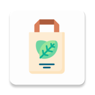

<!--
*** Thanks for checking out this README Template. If you have a suggestion that would
*** make this better, please fork the repo and create a pull request or simply open
*** an issue with the tag "enhancement".
*** Thanks again! Now go create something AMAZING! :D
-->

<!-- PROJECT SHIELDS -->
<!--
*** I'm using markdown "reference style" links for readability.
*** Reference links are enclosed in brackets [ ] instead of parentheses ( ).
*** See the bottom of this document for the declaration of the reference variables
*** for contributors-url, forks-url, etc. This is an optional, concise syntax you may use.
*** https://www.markdownguide.org/basic-syntax/#reference-style-links

[![Contributors][contributors-shield]][contributors-url]
[![Forks][forks-shield]][forks-url]
[![Stargazers][stars-shield]][stars-url]
[![Issues][issues-shield]][issues-url]
[![MIT License][license-shield]][license-url]
[![LinkedIn][linkedin-shield]][linkedin-url]
-->

<!-- 사용하는 기술 정리 -->

<h4 align="center">지원 언어</h4>

   </a> <!-- Android -->

<h4 align="center">개발 기술</h4>

  </a> <!-- Firebase -->
  </a> <!-- Google Cloud -->
  </a> <!-- Android Studio -->
  </a> <!-- Android Studio -->

   </a> <!-- Node.js -->
   </a> <!-- ML Kit -->
   </a> <!-- Naver Map API -->

<h4 align="center">개발 언어</h4>

  </a> <!-- Kotlin -->
  </a> <!-- C++ -->
  </a> <!-- JavaScript -->

<!-- TABLE OF CONTENTS 
## 목차

* [소개](#소개)
  * [문제 및 요구사항](#문제-및-요구사항)
* ~~[사용방법](#사용방법)~~
  * ~~[준비사항](#준비사항)~~
  * ~~[구체적인 사용방법](#구체적인-사용방법)~~

* [Contact](#contact)
* [Acknowledgements](#acknowledgements) -->

<!-- ABOUT THE PROJECT -->
## 소개
> <a>

</a>
> -	거주지 근처, 역 근처 등 생활권 내에 장바구니 보관소를 설치해 두고 **QR코드**를 통해 **장바구니를 대여 · 반납**할 수 있도록 하는 시스템이다. 
> -	이용 횟수에 따라 **포인트를 지급**해 포인트로 **나만의 지구, 마을을 꾸밀 수 있는 아이템**들을 잠금 해제하여 취향에 맞게 꾸밀 수 있도록 한다.
> 
>     <!-- 네이버ppt 링크  -->

<!--
### 문제 및 요구사항

  

 
-->

## 사용법
>   <a href="https://ovenapp.io/view/CfG3Jrx27qCfaSJ5BxDKU9aZ5hA06o89/BUhLs" target="_blank">**Prototype**</a>
> 

### 기능
> **1) 로그인** : 카톡이나 구글 로그인을 포함하여 회원가입해서 로그인
> 
> **2) 대여** : 장바구니 보관소 QR코드를 찍고 보관함의 장바구니를 대여 (대여한 장바구니의 식별은 서버 자동화)
>
> **3) 조회** : 지도 화면에서 주변 GPS기반 보관소 찾기 및 잔여 장바구니 조회 가능
> 
> **4) 회원 정보** : 거주지, 전화번호, 에코 마일리지 등 가입 정보 조회
> 
> **5) 반납**: 보관함 QR찍고 폰에서 반납 버튼을 누르면 보관함이 열리고 반납
> 
> **6) 에코마일리지** : 에코마일리지를 모아 테마, 레벨별 섬꾸미기 기능 ~~(다른 사람의 섬을 구경하고 좋아요 누르는 방식)~~

### ~~UI~~

<!-- USAGE EXAMPLES -->
<!-- ## Usage

Use this space to show useful examples of how a project can be used. Additional screenshots, code examples and demos work well in this space. You may also link to more resources.

_For more examples, please refer to the [Documentation](https://example.com)_ -->

<!-- ROADMAP 
## Roadmap

See the [open issues](https://github.com/othneildrew/Best-README-Template/issues) for a list of proposed features (and known issues). -->

<!-- CONTRIBUTING 
## Contributing

## License

Distributed under the MIT License. See `LICENSE` for more information.
-->

<!-- CONTACT -->
## 팀원구성

> * [박찬호](https://github.com/hoho-97) : cksgh5652@gmail.com
> * [김재현](https://github.com/eoeo0326) : eoeo0326@gmail.com
> * [김진호](https://github.com/Jihn0118) : wlsgh980118@gmail.com
 

## 링크
>  <!-- Trello -->

<!-- ACKNOWLEDGEMENTS -->
<!-- ## Acknowledgements
* [GitHub Emoji Cheat Sheet](https://www.webpagefx.com/tools/emoji-cheat-sheet)
* [Img Shields](https://shields.io)
* [Choose an Open Source License](https://choosealicense.com)
* [GitHub Pages](https://pages.github.com)
* [Animate.css](https://daneden.github.io/animate.css)
* [Loaders.css](https://connoratherton.com/loaders)
* [Slick Carousel](https://kenwheeler.github.io/slick)
* [Smooth Scroll](https://github.com/cferdinandi/smooth-scroll)
* [Sticky Kit](http://leafo.net/sticky-kit)
* [JVectorMap](http://jvectormap.com)
* [Font Awesome](https://fontawesome.com) -->

<!-- MARKDOWN LINKS & IMAGES -->
<!-- https://www.markdownguide.org/basic-syntax/#reference-style-links -
[contributors-shield]: https://img.shields.io/github/contributors/othneildrew/Best-README-Template.svg?style=flat-square
[contributors-url]: https://github.com/othneildrew/Best-README-Template/graphs/contributors
[forks-shield]: https://img.shields.io/github/forks/othneildrew/Best-README-Template.svg?style=flat-square
[forks-url]: https://github.com/othneildrew/Best-README-Template/network/members
[stars-shield]: https://img.shields.io/github/stars/othneildrew/Best-README-Template.svg?style=flat-square
[stars-url]: https://github.com/othneildrew/Best-README-Template/stargazers
[issues-shield]: https://img.shields.io/github/issues/othneildrew/Best-README-Template.svg?style=flat-square
[issues-url]: https://github.com/othneildrew/Best-README-Template/issues
[license-shield]: https://img.shields.io/github/license/othneildrew/Best-README-Template.svg?style=flat-square
[license-url]: https://github.com/othneildrew/Best-README-Template/blob/master/LICENSE.txt
[linkedin-shield]: https://img.shields.io/badge/-LinkedIn-black.svg?style=flat-square&logo=linkedin&colorB=555
[linkedin-url]: https://linkedin.com/in/othneildrew
[product-screenshot]: images/screenshot.png -->
